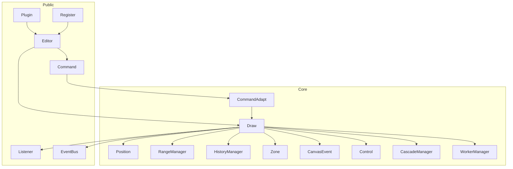

# Architecture

> Based on a static review of the codebase (around v0.9.137). This document describes the current trunk architecture as the baseline for RTL mixed-script work. See [RTL layout design](./rtl-layout-design.md) and [RTL deferred TODO](./rtl-deferred-todo.md).

## Summary

`@hufe921/canvas-editor` is a Canvas/SVG rich-text engine aimed at EMR / forms / print layouts:

> **Draw (runtime core) + Command (facade) + IElement[] (model) + Particle (view) + Zone/Control/Cascade (EMR layer)**

Runtime dependencies are minimal (mainly `prismjs`). Build: Vite 8 → UMD + ESM + d.ts. Quality gates: ESLint, tsc, Vitest, Cypress.

## Repository layout

| Path | Role |
|------|------|
| `src/editor/` | Library core |
| `src/editor/core/` | ~22 runtime subsystems |
| `src/editor/interface/` | TypeScript interfaces |
| `src/editor/dataset/` | Enums and constants |
| `src/editor/utils/` | `formatElementList` / zip / HTML conversion |
| `src/main.ts` + `plugins/` | Demo and sample plugins |
| `tests/` + `cypress/` | Unit and E2E tests |
| `docs/` | VitePress docs |

Largest modules: `Draw.ts`, `CommandAdapt.ts`, `utils/element.ts`.

## Layers and data flow

Typical paths:

1. **Interaction**: CursorAgent / DOM → CanvasEvent handlers → mutate `IElement[]` → `Draw.render()`
2. **API**: `editor.command.execute*` → CommandAdapt → mutate → `Draw.render()`
3. **Paint**: `computeRowList` → Position → Particle/Frame → Listener + EventBus

## Editor public API

| Member | Role |
|--------|------|
| `command` | Mutate / query API |
| `listener` | Single-slot callbacks |
| `eventBus` | Multi-subscriber pub/sub |
| `override` | paste / copy / drop hooks |
| `register` | Context menu / shortcuts / i18n |
| `macro` | Macro orchestration |
| `use` | Plugins |
| `destroy` | Teardown |

## Draw

Central runtime: multi-page canvas, model, row layout, paging, particle dispatch, history submit, callbacks.

`render` outline: compute → `computeRowList` → table paging → position → page canvases → paint → cursor → history → notifications.

Modules: `particle/`, `control/`, `frame/`, `richtext/`, `interactive/`, `graffiti/`, `column/`, `ruler/`.

## Command

`Command` is a facade; `CommandAdapt` owns Draw and performs mutations. Callers must not touch Draw internals.

## Elements and paragraphs

- Storage may be nested (`valueList`); runtime layout is a **flat one-char-per-`IElement` list**
- Paragraphs are implicit via `ZERO` (`\u200B`) and `listId` / `titleId` boundaries — **no `Paragraph` node**
- Paragraph styles such as `rowFlex` live on elements
- **No** `direction` / bidi fields today; canvas context forces `ctx.direction = 'ltr'`

## Position / Range / Cursor

- `IElementPosition.index` aligns with the logical element index
- `RangeManager` uses index ranges (not DOM Range)
- `Cursor` + `CursorAgent`: blink caret DOM + hidden textarea for IME; caret x defaults to glyph `rightTop`

## History

`HistoryManager` stores **full snapshot closures**, not incremental patches. Incremental history is tracked in the deferred TODO list.

## Zones / modes / extension

- Zones: `HEADER` / `MAIN` / `FOOTER`
- Modes: EDIT / CLEAN / READONLY / FORM / PRINT / DESIGN / GRAFFITI / TRACE
- Extension: Plugin / Override / Register; EMR: Control + Cascade + Validate + Trace

## Trade-offs

| Strength | Cost |
|----------|------|
| Real paging / headers / print control | Large Draw surface |
| Canvas consistency for EMR | Custom selection / a11y |
| Rich API, few deps | No OT/CRDT; snapshot history |
| Workers for heavy jobs | Still clones element lists on the main thread |

## Relation to RTL work

The current text pipeline is LTR-only. RTL/LTR mixed layout will live in an independent `text-engine` (HarfBuzz + Bidi) behind a thin host adapter. See [RTL layout design](./rtl-layout-design.md).
