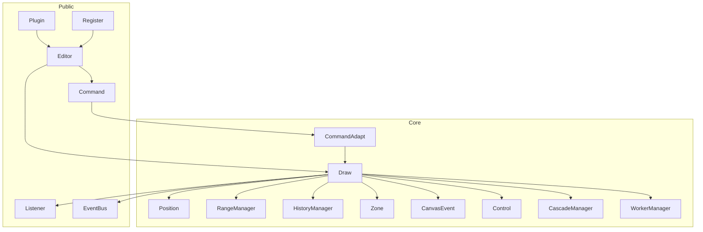

# 架构分析

> 基于源码静态分析（约 v0.9.137）。本文描述当前主干架构，作为 RTL 混排改造的基线。相关设计见 [RTL 排版设计](./rtl-layout-design.md)，延期事项见 [RTL 延期 TODO](./rtl-deferred-todo.md)。

## 核心结论

`@hufe921/canvas-editor` 是一套自研 Canvas/SVG 富文本引擎，面向 EMR / 表单 / 套打。架构可概括为：

> **Draw（内核）+ Command（门面）+ IElement[]（模型）+ Particle（视图）+ Zone/Control/Cascade（EMR 能力层）**

生产依赖极少（主要为 `prismjs`）。构建：Vite 8 → UMD + ESM + d.ts；质量门禁含 ESLint、tsc、Vitest、Cypress。

## 工程骨架

| 路径 | 职责 |
|------|------|
| `src/editor/` | 库核心：Draw / Command / 事件 / 粒子 / 接口 |
| `src/editor/core/` | 约 22 个运行时子系统 |
| `src/editor/interface/` | TypeScript 接口 |
| `src/editor/dataset/` | 枚举与常量 |
| `src/editor/utils/` | `formatElementList` / zip / HTML 转换等 |
| `src/main.ts` + `plugins/` | Demo 与示例插件 |
| `tests/` + `cypress/` | 单元测试与 E2E |
| `docs/` | VitePress 中英文档 |

体量上，`Draw.ts`、`CommandAdapt.ts`、`utils/element.ts` 是三大核心文件。

## 分层与数据流

典型编辑路径：

1. **交互**：CursorAgent / DOM → CanvasEvent handlers → 改 `IElement[]` → `Draw.render()`
2. **API**：`editor.command.execute*` → CommandAdapt → 改模型 → `Draw.render()`
3. **渲染**：`computeRowList` → Position → Particle/Frame 绘制 → Listener + EventBus

## Editor 公共 API

构造：`mergeOption` → 拆分 header/main/footer → `formatElementList` → Listener/EventBus/Override → Draw → Command → Macro/ContextMenu/Shortcut/Register。

| 成员 | 作用 |
|------|------|
| `command` | 全部 mutate / query（`execute*` / `get*`） |
| `listener` | 单回调槽位（旧式） |
| `eventBus` | 多订阅 pub/sub |
| `override` | 覆盖 paste / copy / drop |
| `register` | 右键菜单 / 快捷键 / i18n |
| `macro` | 宏命令编排 |
| `use` | 插件安装 |
| `destroy` | 释放资源 |

## Draw 引擎

`Draw` 是运行时内核（God-object）：多页 Canvas、文档模型、行排版、分页、粒子分发、历史提交与回调。

`render` 流水线概要：`isCompute` → header/footer/column compute → `computeRowList` → tablePaging → position / area / search → 页 canvas 创建或删除 → 绘制 → `setCursor` → `submitHistory` → nextTick 通知。

内部模块：`particle/`、`control/`、`frame/`、`richtext/`、`interactive/`、`graffiti/`、`column/`、`ruler/`。

## Command 模式

- `Command`：Facade，对外 `execute*` / `get*`
- `CommandAdapt`：持有 Draw，执行实际变更
- 外部禁止直接操作 Draw 内部 API

## 元素与段落语义

- 持久化可为嵌套（`valueList`）；运行时布局为**扁平一字一 `IElement`**
- 段落由 `ZERO`（`\u200B`，由 `\n` 归一）及 `listId` / `titleId` 边界隐式界定，**无独立 Paragraph 节点**
- 段落样式（如 `rowFlex` / `rowMargin`）挂在元素上，命令写到选区行内元素
- `IElement.direction` / 段落 bidi 方向由 text-engine host 解析；GlyphRenderer 负责 HarfBuzz 字形绘制，表格/控件通过适配层接入

## Position / Range / Cursor

- `IElementPosition`：逻辑 index 对齐元素下标；坐标为四角矩形
- `RangeManager`：索引选区（非 DOM Range），支持表格跨单元格
- `Cursor` + `CursorAgent`：闪烁模拟光标 DOM + 隐藏 textarea 承接 IME；当前默认用字符 `rightTop` 作为光标 x

## 历史

`HistoryManager` 使用**闭包全量快照**（克隆 main/header/footer + range + zone），非增量 patch。大文档内存成本高，增量历史见延期 TODO。

## Zone / 模式 / 扩展

- Zone：`HEADER` / `MAIN` / `FOOTER`，切换活动数据源
- `EditorMode`：EDIT / CLEAN / READONLY / FORM / PRINT / DESIGN / GRAFFITI / TRACE
- 扩展：`Plugin.use`、`Override`、`Register`；EMR：Control + Cascade + Validate + Trace

## 测试

- Vitest：command、history、zone、cascade、validate、表格分页等
- Cypress：menus 与 control；依赖 demo 暴露 `window.editor`

## 取舍

| 优势 | 代价 |
|------|------|
| 真分页 / 页眉页脚 / 打印像素可控 | Draw 体量大，改动牵连面广 |
| Canvas 一致性适合套打/EMR | 选区与可访问性需自研 |
| API 面完整、依赖极少 | 无协同 OT/CRDT；历史全量克隆 |
| Worker 卸载部分重计算 | 仍需主线程克隆元素列表 |

## 与 RTL 改造的关系

正文 RTL/LTR 混排已由独立 `text-engine` 通过 HarfBuzz 整形与 Bidi 实现，并经薄适配层接入 Draw；未迁移的 legacy/复合布局路径及后续事项见 [RTL 延期 TODO](./rtl-deferred-todo.md)。
