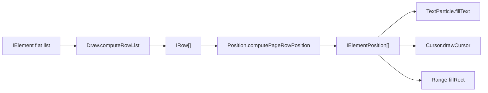
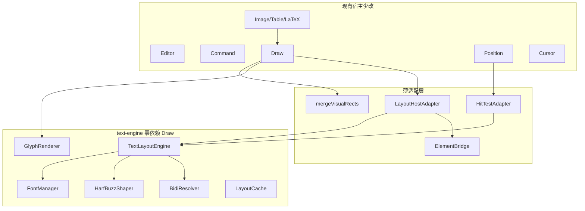
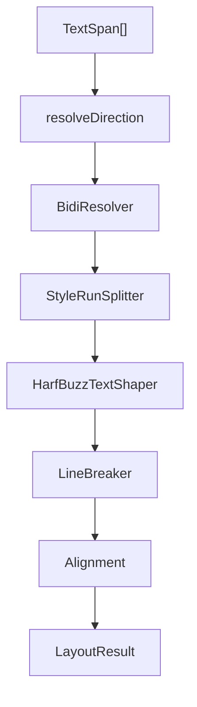
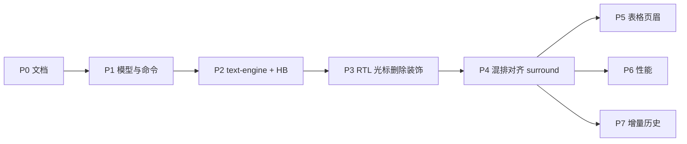

# RTL 排版与渲染引擎设计

> 目标：在现有扁平 `IElement[]` 模型上支持阿拉伯语等 RTL 与 LTR 混排；**HarfBuzz 为本期必选整形路径**；排版/绘制引擎相对独立，降低对 `Draw` 的侵入。  
> 基线架构见 [架构分析](./architecture.md)；延期事项见 [RTL 延期 TODO](./rtl-deferred-todo.md)。

## 1. 设计目标与既定决策

1. 纯 Canvas 排版与渲染；正式度量来自 HarfBuzz advance，自绘视觉坐标，**不依赖**全局 `ctx.direction`。
2. 精确字符/连字内光标与点击命中（cluster 映射）。
3. 完整 Bidi（UAX#9）：段落方向 `ltr` / `rtl` / `auto`；对齐 `start` / `end` / 物理左右 / center / justify。
4. 富文本样式区间（沿用一字一元素上的样式字段）。
5. 完整编辑：视觉方向键、逻辑删除、IME、模拟光标双 DOM 同步。
6. DOM 壳：CursorAgent textarea + 工具栏；引擎不依赖 UI 框架。
7. 历史：本期仍用快照；增量历史见 [DEFER-009](./rtl-deferred-todo.md#defer-009)。

**不做**：将存储模型改成独立 `Paragraph[]` + `AttributeRange`；把 HB/Bidi 散落进 `Draw.ts` / 各 Particle。

## 2. 现状差距

当前管线：



硬约束：`ctx.direction = 'ltr'`；`x += width` 仅左到右；无 `direction` 字段；段落 = `ZERO` 边界；历史为全量快照。

| 方案稿概念 | 当前等价物 | 改造方式 |
|-----------|-----------|---------|
| `Paragraph.text` | `ZERO`…下一 `ZERO` 元素 `value` 拼接 | 逻辑扫描器，不改存储 |
| `AttributeRange` | 字符元素样式字段 | 排版时聚合成 StyleRun |
| `direction` / `textAlign` | 无 / `rowFlex` | 新增 `direction`；`rowFlex` 增加 `start`/`end` |
| Layout Engine | `computeRowList` 内联 | 独立 `text-engine` |
| HarfBuzz | `measureText` | **本期** `HarfBuzzTextShaper` |
| 可逆 Command | 闭包快照 | [DEFER-009](./rtl-deferred-todo.md#defer-009) |

## 3. 数据模型扩展

### 3.1 字段

在 `IElementStyle` 增加：

```ts
direction?: TextDirection // 'ltr' | 'rtl' | 'auto'
```

`RowFlex` 新增 `start` | `end`（按 resolvedDirection 映射到物理左右）；保留 `left`/`right`/`center`/`alignment`/`justify`。

同步：

- `EDITOR_ROW_ATTR` / `EDITOR_ELEMENT_PARAGRAPH_STYLE_ATTR` / `EDITOR_ELEMENT_ZIP_ATTR`
- `IEditorOption.defaultDirection`（内容默认，默认 `auto`；命令 `executeDirection`）
- `IEditorOption.direction`（**UI 模式** `ltr`|`rtl`，默认 `ltr`；命令 `executeUiDirection`；打 `ce-ui-rtl`，不设容器 `dir`）
- `IEditorOption.textEngine?: 'legacy' | 'harfbuzz'`
- `IEditorOption.fonts` / `caretMovement?: 'visual' | 'logical'`
- `IRow.direction?: 'ltr' | 'rtl'`（派生）
- 运行时旁路（不入 zip）：`bidiLevel` / `visualIndex` / `clusterStart` / `clusterEnd`

### 3.2 段落扫描（逻辑层）

`ParagraphScanner`：输入扁平 `IElement[]`，输出 `{ startIndex, endIndex, direction, rowFlex }` spans。边界复用现有段落规则（`ZERO` / `listId` / `titleId`）。**不引入**持久化 `paragraphId`；API 仍用 element index。

### 3.3 对齐

| 存储值 | LTR | RTL |
|--------|-----|-----|
| `start` | 左 | 右 |
| `end` | 右 | 左 |
| `left` / `right` | 物理 | 物理 |
| `center` / `alignment` / `justify` | 现有 + 视觉序 | 同左；justify 沿视觉序 |

### 3.4 命令

- `executeDirection(dir)`
- `getRangeParagraphDirection()`
- HTML：识别 `dir` / `direction:rtl`；zip 持久化 `direction`

## 4. 独立引擎边界（低侵入）

目标：引擎可单测、可替换；Draw 只编排。



### 4.1 目录

```
src/editor/core/text-engine/
  index.ts
  types.ts
  layout/TextLayoutEngine.ts
  bidi/BidiResolver.ts
  shape/HarfBuzzTextShaper.ts
  shape/ITextShaper.ts
  font/FontManager.ts
  render/GlyphRenderer.ts
  cache/LayoutCache.ts
src/editor/core/text-engine-host/
  ElementBridge.ts
  LayoutHostAdapter.ts
  HitTestAdapter.ts
  mapToLegacyRow.ts
```

### 4.2 依赖规则

| 允许 | 禁止 |
|------|------|
| `text-engine` → 自身 types + harfbuzz / opentype / bidi | `text-engine` import Draw / Command / Particle |
| `text-engine-host` → engine + `IElement` 等模型 | 在 `computeRowList` 内直接调 HB API |
| Draw/Position 只调 host 公开方法 | 在多个 Particle 内复制 cluster/bidi 逻辑 |

### 4.3 宿主改动面

1. Draw 文本分支 → `LayoutHostAdapter.layout`；table/image 等仍旧路径。
2. Position/Cursor/方向键 → `HitTestAdapter`。
3. TextParticle → 委托 `GlyphRenderer`。
4. 装饰/选区 → `mergeVisualRects`。
5. Command/History/zip → 仅字段与 `executeDirection`。
6. `textEngine` 双路径降低一次性风险；过渡期 `mapToLegacyRow` 投影到 `IRow` / `IElementPosition`（拆除见 [DEFER-016](./rtl-deferred-todo.md#defer-016)）。

## 5. 排版流水线

引擎内（类型为 `TextSpan` / `LayoutResult`，**无 IElement**）：



| 模块 | 职责 | 实现 |
|------|------|------|
| BidiResolver | UAX#9 visual runs | `bidi-js`（不足时见 [DEFER-012](./rtl-deferred-todo.md#defer-012)） |
| StyleRunSplitter | Bidi ∩ 样式 | TextSpan 样式键 |
| HarfBuzzTextShaper | glyphs/clusters/advance | **必选**；BrowserShaper 仅开发兜底 |
| FontManager | HB Font + opentype | ArrayBuffer；fallback 链 |
| LineBreaker | 按 advance 断行 | `Intl.Segmenter` |
| Alignment | start/end/物理/justify | 引擎内完成 |
| GlyphRenderer | glyph → Canvas | Path2D / atlas |
| LayoutCache | 脏段缓存 | 段落 key |

### 5.1 HarfBuzz

```
StyleRun { text, direction, script, language, fontKey }
  → FontManager.get(fontKey)
  → hb.shape(...)
  → ShapedGlyph[] { glyphId, cluster, ax, dx, dy, charStart, charEnd }
```

- 依赖：`harfbuzzjs` + `opentype.js`
- 字体：至少一套阿语+拉丁；`IEditorOption.fonts` 注册
- 初始化：WASM/字体就绪门闩；未就绪不进入正式验收路径
- 坐标自绘；**不用** `ctx.direction` 代替 shape
- cluster ↔ 逻辑 element index；连字内光标比例切分
- LaTeX SVG **不经** HarfBuzz（见 §9）

### 5.2 不变量

1. `elementList` 逻辑序不变；命令/历史仍用 index。
2. 视觉序只存在于布局结果；`IElementPosition.index` 始终为逻辑下标。
3. 本期启用 `clusterStart` / `clusterEnd`。

## 6. 输入、模拟光标与删除

### 6.1 键盘语义

| 交互 | 行为 |
|------|------|
| 左/右 | **视觉**邻接（默认）；`caretMovement` 可切 logical |
| Backspace/Delete | **逻辑**删除（≠ 视觉邻接） |
| Home/End | 视觉行首/尾 |
| 点击拖拽 | `pointToLogicalIndex` |
| IME | Agent `dir` = 段落方向；`isComposing` 时 keydown 短路 |

### 6.2 模拟光标（本期必做）

```
logicalIndex (+ hitLineStart?)
  → HitTestAdapter.caretMetrics()
  → { x, y, height, pageNo, affinity }
  → cursorDom + agentCursorDom 同步定位
```

- 禁止恒假设贴 `rightTop`；affinity 由 bidi level 决定视觉边。
- 行首点击用视觉行起点。
- 闪烁条与 Agent **同一套** metrics。
- 连字内与点击同一插值公式。
- 页偏移仍由 Cursor 叠加 `pageNo * (height + pageGap)`。

### 6.3 删除监听（本期必做）

- 入口保持：`keydown` → `backspace` / `del`（见 `handlers/keydown/`）。
- 合成中不处理删除键。
- **不**以 textarea `beforeinput` 删除为主路径（移动端见 [DEFER-021](./rtl-deferred-todo.md#defer-021)）。
- 控件/隐藏/留痕/表格跨格业务保留在原 handler。
- 阿语：一次删一个 grapheme/cluster，对齐 HB cluster。
- 删除后 `render` → `drawCursor` 走 §6.2。

视觉邻接删除若产品需要：见 [DEFER-022](./rtl-deferred-todo.md#defer-022)。

## 7. 渲染

- `GlyphRenderer` 在引擎内；TextParticle 在 harfbuzz 模式下薄委托。
- 度量仅 HB advance。
- 装饰/选区统一 `mergeVisualRects`（视觉 left/right，禁止「逻辑序首 x + 右向 width+=」）。
- Hyperlink / 上下标 / Label 复用引擎 glyph 段 API。
- Image / Table / LaTeX / Graffiti **不进** text-engine。
- 脏区、分页懒渲染、print/toDataURL 仍由 Draw 负责。

## 8. 正文阶段必须改的 Canvas 路径（相对「五件套」）

### A — 本期

`ctx.direction`；`AbstractRichText` + Underline/Strikeout/Highlight；Trace；Group；ControlBorder；Hyperlink/Sub/Superscript（引擎行走 GlyphRenderer）；Float surround 基础路径；DATE 分段 complete。

### B — 与 P3 一并

ListParticle 缩进与符号侧；LineBreak；Placeholder；LineNumber / PageNumber **侧边镜像**（未做完记 [DEFER-015](./rtl-deferred-todo.md#defer-015)）。

### C — 通常不动

Background、Margin、PageBorder、Graffiti、Magnifier、Ruler、Search 单格高亮、Print。

纯文本 chrome（水印 / 页码格式串 / 分页提示 / 图注）：`textEngine=harfbuzz` 且引擎就绪时走 `layoutPlainText` + `GlyphRenderer`（BiDi 混排、按 `fonts[].scripts` 选脸、阿语连写）；未就绪时回退 `fillText`。共用 `drawPlainText` 辅助。

**LTR/RTL 模式** `options.direction: 'ltr'|'rtl'`（默认 ltr）：仅编辑器 UI 壳层方向（容器打 `ce-ui-rtl` class、工具栏/底栏镜像；**不得**给画布容器设 `dir=rtl`，否则绝对定位光标碰撞错位）以及新建行/表写入的默认 `element.direction`；**不**参与存量正文方向解析、光标碰撞与文本区绘制；**切换不得**重排/重绘正文。表框镜像仅看表格自身 `direction`（新建表会带上当前模式）。与段落 `executeDirection` / `defaultDirection` **分离，勿混用**。命令 `executeUiDirection`。模式切换控件由 `uiDirectionToggle`（默认 true）控制是否展示。

### D — 延期

见表格/控件等 [rtl-deferred-todo](./rtl-deferred-todo.md)。正文路径收口缺口亦登记于此：DATE/LABEL 与 GlyphRenderer 对齐 [DEFER-023](./rtl-deferred-todo.md#defer-023)；段内 Control 等嵌入 [DEFER-024](./rtl-deferred-todo.md#defer-024)；环绕图/分栏混排验收 [DEFER-025](./rtl-deferred-todo.md#defer-025)。

### mergeVisualRects

```ts
mergeVisualRects(
  items: { left: number; right: number; y: number; height: number }[]
): Rect[]
```

Underline / Strikeout / Highlight / Trace / Group / ControlBorder / Range 共用。

## 9. SVG 影响

- 主干无 DOM 文档 SVG 层；LaTeX 为 `data:image/svg+xml` → `drawImage`。
- **禁止**为文档 RTL 翻转 LaTeX path；数学公式恒为 LTR 岛屿。
- 行内盒子只消费视觉 `x,y`。
- Badge `right` 锚点见 [DEFER-005](./rtl-deferred-todo.md#defer-005)。
- `feature/svg` 分支评估见 [DEFER-013](./rtl-deferred-todo.md#defer-013)。

## 10. 历史（并行，不阻塞 RTL）

本期字段随快照自动进入现有 `submitHistory`。增量命令历史、合并、压缩见 [DEFER-009](./rtl-deferred-todo.md#defer-009)。

## 11. 测试与兼容

- 无 `direction` ≡ `ltr`；HB 路径下锁定字体做 LTR 回归（约定亚像素容差）。
- 单测：Bidi、HB cluster、连字 caret、logical↔visual、选区多矩形、FontManager。
- Cypress：阿语连字点击/方向键、混排、IME dir、Backspace/Delete 后光标、工具栏 direction。
- CI：可加载 WASM + 字体 fixture。

## 12. 路线图



| 阶段 | 目标 | 验收 |
|------|------|------|
| P0 | 本文档 + architecture + deferred-todo | VitePress 可浏览 |
| P1 | direction/start/end、zip、executeDirection、fonts | 旧文档兼容 |
| P2 | 独立引擎 + HB + Font + Glyph + 开关 | 引擎可单测；Draw 仅 Adapter |
| P3 | RTL + 模拟光标双 DOM + 逻辑删除 + 装饰/列表 | 连字定位；删除后光标正确 |
| P4 | 混排 + start/end + surround | 混排用例 |
| P5+ | 见延期 TODO | — |

## 13. 相关链接

- [架构分析](./architecture.md)
- [RTL 延期 TODO](./rtl-deferred-todo.md)
- [数据结构](./schema.md)
- [配置](./option.md)
